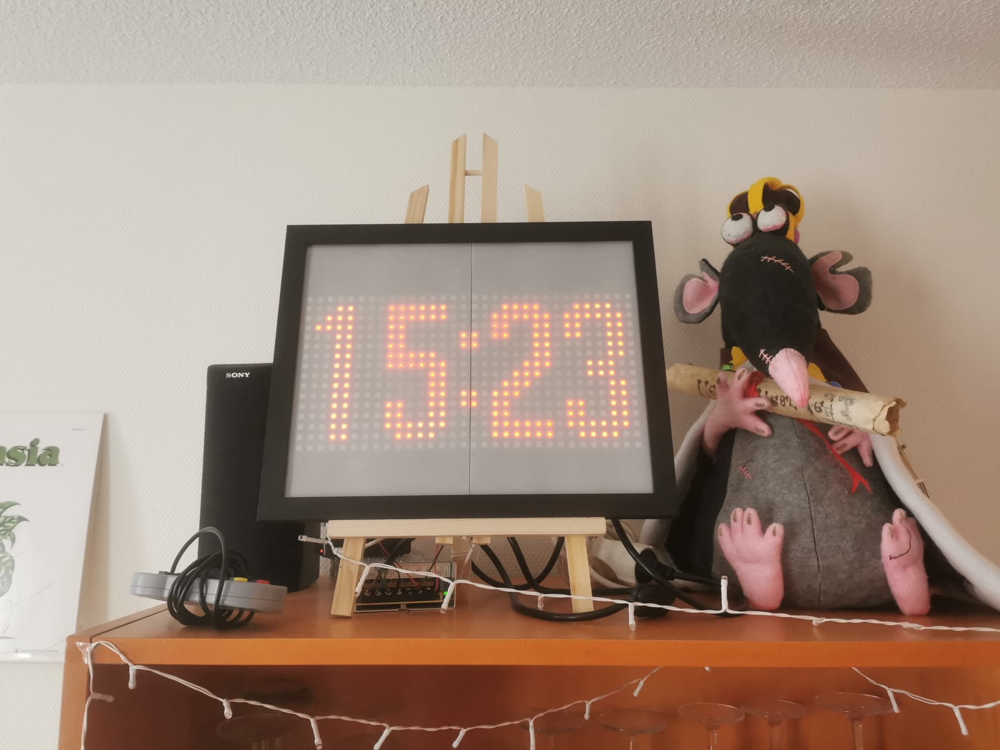
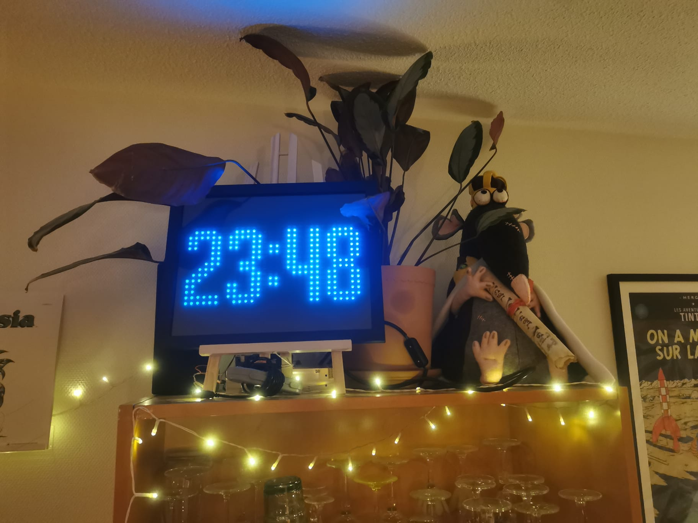

# LED Matrix

This project contains the code to control a 16x32 LED matrix connected to a Raspberry Pi. 

## Prototype 1

Here is the first working version!

## Prototype 2

Because the LED matrix is *much* brighter than expected (the 5V 20A powersupply necessary should have been an indication), I have reduced the brightness by salvaging two polarised filters from old computer screens and placing them at a slight angle w.r.t eachother in the photframe. Now I can finally use colors!

Note: the steeper the angle you look at the clock, the brighter the numbers appear. I suspect this has something to do with the way the polarised filters are fabricated, or possibly some internal reflections (?).

